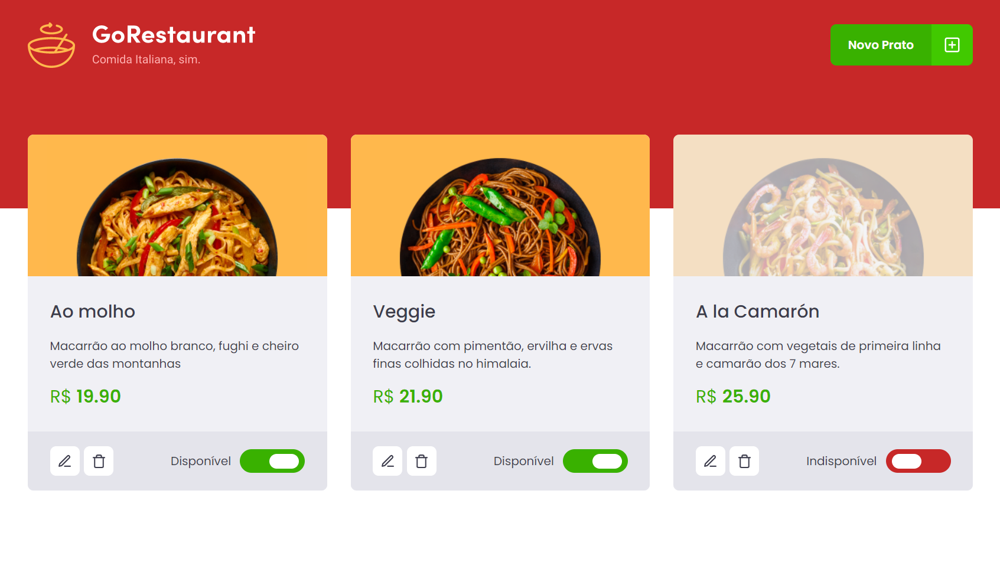
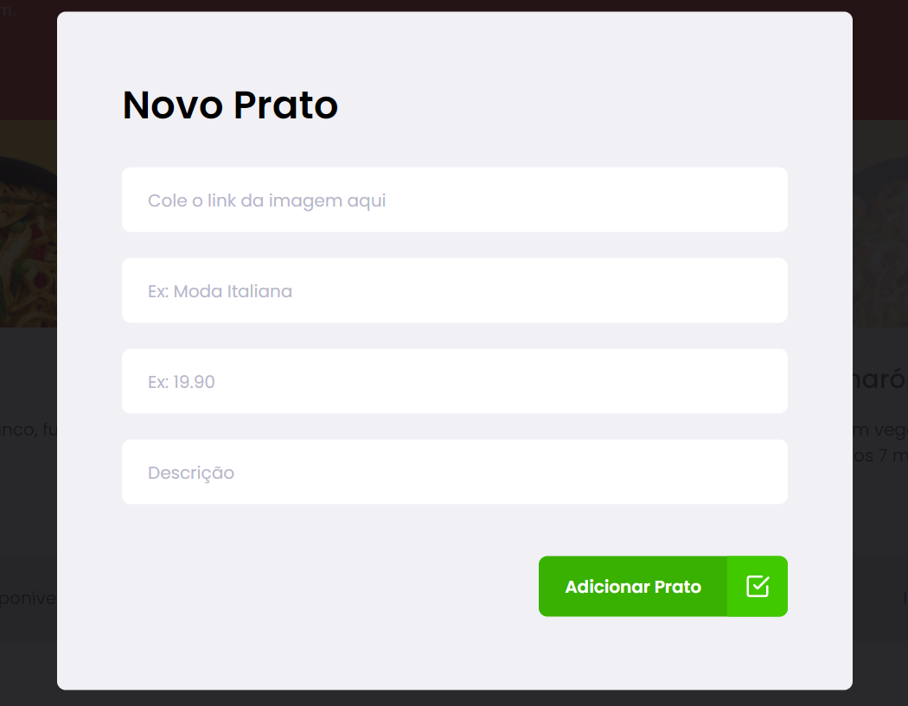

## Go Restaurant

Este repositório trata-se do quarto desafio da trilha de  **Trilha de ReactJS** do bootcamp **Ignite** da [Rocketseat](https://www.rocketseat.com.br).


## Como executar a aplicação

Basta utilizar Npm ou Yarn e rodar um dos comandos abaixo para instalar as dependências do projeto:

**npm install** ou **yarn**

<ul>
 <li>Para inicializar o projeto, execute os comandos abaixo:</li>
</ul>

```
npm/yarn start
npm/yarn server para rodar o servidor (json server)
```

## Imagens da aplicação


